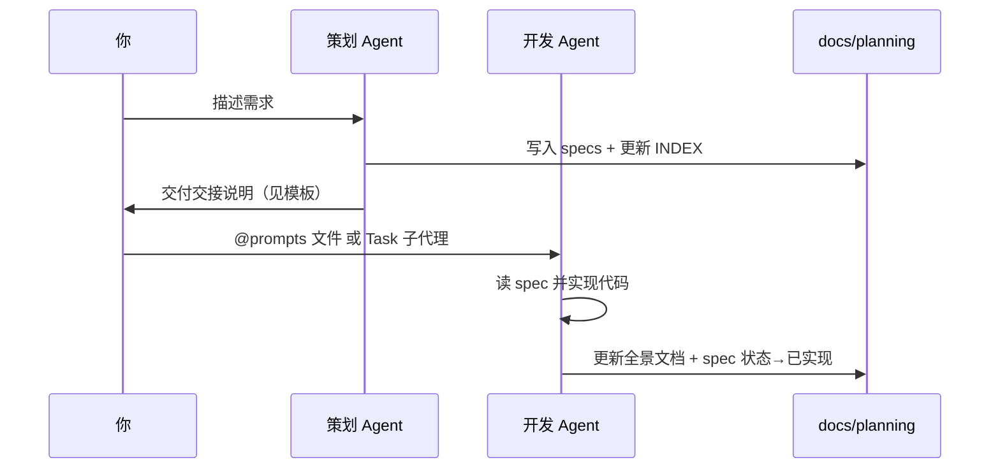

# 策划 Agent → 开发 Agent 交接规范

本项目采用 **双 Agent 分工**：策划只写文档，开发只写代码。二者通过 `docs/planning/` 下的文档衔接。

**完整流程（策划 → 计划表 → 开发 prompt → 验收 → 结案）**：见 [策划到开发工作流.md](./策划到开发工作流.md)。  
**六个专用 Agent 协作**：见 [多Agent工作流.md](./多Agent工作流.md)。

---

## 角色边界

| 角色 | 负责 | 禁止 |
|------|------|------|
| **策划 Agent** | 需求澄清、PRD、更新 `INDEX.md` / `CHANGELOG.md`（策划侧）、全景文档章节草案 | 修改 `mobile/`、`server/`、`shared/` 源码 |
| **开发 Agent** | 按 `specs/*.md` 实现功能、单测/自测、实现后回写全景文档与 API 说明 | 擅自扩大范围、跳过验收标准 |

策划产出 **「可开发」** 的标志：`specs/<功能>.md` 状态为 **已确认**，且 `INDEX.md` 已登记。

---

## 交接流程



1. **你**向策划 Agent 描述需求（可只说目标，细节由策划补全并请你确认）。
2. **策划 Agent** 产出 `docs/planning/specs/<功能名>.md`，状态 **已确认**，更新 `INDEX.md`。
3. **策划 Agent** 在 `specs/vX.Y.Z-开发交接.md` 写入「交接提示词」并运行 `npm run planning:confirm -- vX.Y.Z`（登记计划表 + 生成 prompt），**到此结束，不写代码**。
4. **你**将 `prompts/vX.Y.Z-dev.prompt.md` 交给开发 Agent（见下方三种方式，**无需手抄**）。
5. **开发 Agent** 仅依据 spec 与全景基线开发；验收通过后运行 `npm run planning:accept -- vX.Y.Z` 结案并更新计划表。

---

## 三种派发方式（免手抄）

| 方式 | 操作 | 需要 |
|------|------|------|
| **A. @ 文件** | 新开发对话 → `@docs/planning/prompts/vX.Y.Z-dev.prompt.md` →「按此实现」 | 无 |
| **B. 子代理** | 策划对话：「用 Task 读 prompts/… 并实现」 | 同会话批准 |
| **C. SDK** | `npm run planning:dispatch -- vX.Y.Z` | `CURSOR_API_KEY` |

详见 [prompts/README.md](./prompts/README.md)。

---

## 给开发 Agent 的标准提示词（备选）

**优先** `@docs/planning/prompts/vX.Y.Z-dev.prompt.md`。亦可复制 [templates/开发交接说明.md](./templates/开发交接说明.md) 中代码块。

最小示例：

```
你是本项目的开发 Agent。请只实现代码，策划文档已就绪。

必读（按顺序）：
1. docs/planning/specs/【功能名】.md  ← 需求与验收标准，以此为准
2. docs/planning/product/v0.1.0-功能全景.md 相关章节
3. docs/planning/WORKFLOW.md §4 代码位置索引

要求：
- 严格按 spec 的 P0 验收标准实现，不擅自加功能
- 完成后：spec 状态改为「已实现」；更新全景文档与 CHANGELOG.md
- 不要重写无关模块

禁止：在无 spec 或 spec 状态非「已确认」时开工。
```

---

## 策划 Agent 结束语模板

策划完成时应回复用户类似内容（**不包含代码变更**）：

> 策划文档已就绪：`docs/planning/specs/xxx.md`（状态：已确认）  
> 提示词文件：`docs/planning/prompts/vX.Y.Z-dev.prompt.md`（`npm run planning:prompt -- vX.Y.Z`）  
> 请新开 **开发 Agent**，`@` 上述 prompt 文件并说「按此实现」。  
> 我未修改任何源码。

---

## 状态流转

| 状态 | 含义 | 谁改 |
|------|------|------|
| 草案 | 策划撰写中 | 策划 Agent |
| 评审中 | 待你确认范围 | 策划 Agent / 你 |
| **已确认** | 可交给开发 Agent | 策划 Agent |
| **已实现** | 开发完成且文档已同步 | 开发 Agent |
| 已取消 | 不做 | 策划 Agent |

---

## 说明：他人主页优化

该需求曾由同一 Agent 兼做策划与开发（不符合本规范）。  
当前 spec：[specs/他人主页优化.md](./specs/他人主页优化.md)。  
后续新需求请严格按本章「策划只文档、开发只代码」执行。
