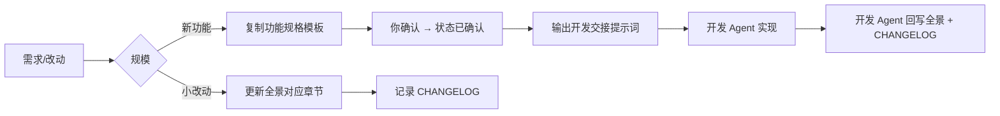

# 策划工作流

本文定义 Fish Social 策划文档的创建、评审、发布与**交给开发 Agent** 的流程。

> **重要**：策划 Agent **只产出文档**，不修改 `mobile/`、`server/`、`shared/`。  
> 开发由独立 Agent 按 [HANDOFF.md](./HANDOFF.md) 交接。  
> **策划 → 计划表 → 开发 → 验收结案** 全链路见 [策划到开发工作流.md](./策划到开发工作流.md)。

---

## 0. 双 Agent 分工（必读）

| 阶段 | 负责 | 产出 |
|------|------|------|
| 策划 | 策划 Agent | `specs/*.md`（状态：已确认）+ 开发交接提示词 |
| 开发 | 开发 Agent | 源码 + spec 状态→已实现 + 全景文档回写 |

详见 [HANDOFF.md](./HANDOFF.md)、[templates/开发交接说明.md](./templates/开发交接说明.md)。

---

## 1. 文档类型

| 类型 | 路径 | 用途 | 更新频率 |
|------|------|------|----------|
| **功能全景** | `product/vX.Y.Z-功能全景.md` | 当前版本的完整功能基线 | 每个 App 版本发布前 |
| **专项策划** | `specs/<主题>.md` | 单模块深度设计（数值、增长、商业化等） | 按需 |
| **功能规格** | `specs/<功能名>.md` | 新功能 PRD（范围、交互、验收） | 开发前 |
| **策划变更记录** | `CHANGELOG.md` | 策划文档目录本身的修订历史 | 每次改策划文档 |

---

## 2. 标准工作流

### 2.1 新功能（策划 Agent）

1. 在 `specs/` 下复制 [功能规格模板](./templates/功能规格模板.md)，命名为 `specs/<功能名>.md`。
2. 填写：背景、目标用户、交互、数据、API、验收标准、**非目标**。
3. 请你确认后，将 spec 状态设为 **已确认**，更新 [INDEX.md](./INDEX.md)。
4. 在 `specs/vX.Y.Z-开发交接.md` 填写「交接提示词」代码块（见 [v0.2.6 示例](./specs/v0.2.6-开发交接.md)）。
5. 运行 `npm run planning:confirm -- vX.Y.Z`（更新 [项目开发需求计划表.xlsx](./项目开发需求计划表.xlsx) + 生成 `prompts/vX.Y.Z-dev.prompt.md`）。
6. 告知用户用 **@prompt 文件** 或 **Task 子代理** 交给开发 Agent（见 [HANDOFF.md](./HANDOFF.md)），**结束策划工作**。

### 2.2 开发中（开发 Agent）

- 仅依据 **已确认** 的 spec 实现。
- 若实现与策划不一致，在 PR 或 spec 末尾标注「实现偏差」及原因。
- 涉及数值常量：改 `shared/`，并由开发 Agent 回写全景文档。
- 验收通过后由你或开发 Agent 执行 `npm run planning:accept -- vX.Y.Z`（见 [策划到开发工作流.md](./策划到开发工作流.md) §阶段 4）。

### 2.3 版本发布前（开发 Agent 主导，策划可复核）

1. 复制或重命名全景文档为 `product/vX.Y.Z-功能全景.md`（与新版本号一致）。
2. 通读并更新：功能模块、API、数据模型、已知限制。
3. 更新 [INDEX.md](./INDEX.md) 中的版本对照表。
4. 在 [CHANGELOG.md](./CHANGELOG.md) 追加条目。

### 2.4 日常小改（bug、文案、数值微调）

- 直接修改当前版本全景文档对应章节。
- `CHANGELOG.md` 简要记录「改了什么、为什么」。

---

## 3. 命名规范

| 对象 | 规范 | 示例 |
|------|------|------|
| 全景文档 | `v{semver}-功能全景.md` | `v0.1.0-功能全景.md` |
| 专项策划 | `{主题}.md`，中文或英文 | `生态数值调优.md` |
| 功能规格 | `{功能名}.md` | `鱼塘天气系统.md` |

---

## 4. 与代码的同步检查清单

发布或合并前，策划应核对以下源码位置是否与文档一致：

| 策划章节 | 代码位置 |
|----------|----------|
| 游戏常量 / 钓鱼概率 | `shared/constants.ts` |
| 鱼种 / 品质 | `shared/fish.ts` |
| 鱼塘 / 地图 | `shared/ponds.ts` |
| 生态配置 | `shared/pondEcology.ts` |
| 经济公式 | `shared/economy.ts` |
| 社交类型 | `shared/social.ts`、`shared/types.ts` |
| REST API | `server/src/socialRoutes.ts`、`server/src/admin.ts` |
| WebSocket | `server/src/index.ts` |
| 机器人 | `server/src/bots.ts` |
| 客户端页面 | `mobile/app/*.tsx` |
| App 版本号 | `mobile/app.json` → `expo.version` |

---

## 5. 评审要点

策划文档评审（自检或同伴）至少覆盖：

- [ ] 用户角色与权限是否写清
- [ ] 核心流程是否有步骤或流程图
- [ ] 数值、上限、冷却是否与 `shared/` 一致
- [ ] API / Socket 事件是否完整
- [ ] 「已知限制」是否反映当前实现缺口
- [ ] 版本号与 `app.json` 一致

---

## 6. AI 协作说明

### 策划 Agent（`docs/planning/**`）

- 只读源码以核对现状、写准 PRD；**禁止改** `mobile/`、`server/`、`shared/`。
- 产出 spec + 交接提示词后停止。
- 规则：`.cursor/rules/planning-docs.mdc`

### 开发 Agent（`mobile/`、`server/`、`shared/`）

- 必须先读 `specs/` 中 **已确认** 的文档再开工。
- 完成后回写全景文档与 CHANGELOG。
- 规则：`.cursor/rules/dev-from-planning.mdc`

---

## 7. 后续扩展（预留）

`specs/` 目录可用于：

- 生态数值调优方案
- 金币消耗与商城设计
- 账号安全与登录改造
- 推送与运营活动

专项文档成熟后，将结论合并进下一版 `product/vX.Y.Z-功能全景.md`。
