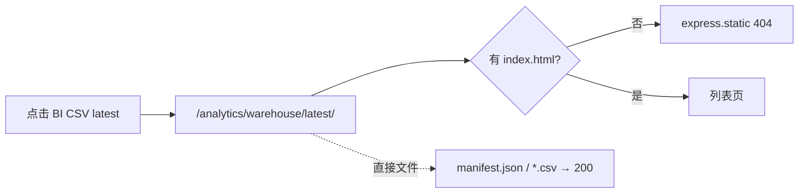

# BUG 修复：BI latest 404 与游戏 Web 端口打不开

| 状态 | **已实现** | 目标版本 hotfix / v0.6.x |
|------|--------------------|---------------------------|
| 完成时间 | **2026-07-12** | 设计时间 2026-07-12 |
| 优先级 | **P0**（运营入口不可用） | |
| 编号 | **BUG-12** | 计划表 `项目开发需求计划表.xlsx` |
| 范围 | 运营平台入口 · `express.static` 分析静态目录 · Expo Web `:8082` · `打开运营平台.bat` |
| 触发 | 2026-07-12：运营平台卡片「BI CSV（latest）」打不开；「游戏 Web」端口打不开 / 间歇不可用 |
| 关联 | [`BUG修复-tsx-watch启动挂死.md`](./BUG修复-tsx-watch启动挂死.md)（BUG-11）· [`数据平台-DP-D-BI与合规交接.md`](./数据平台-DP-D-BI与合规交接.md)（D-L3-06）· [`服务器维护-端口占用.md`](./服务器维护-端口占用.md) |

---

## 1. 现象（用户侧）

| 入口 | 期望 | 实际 |
|------|------|------|
| 运营平台 → **BI CSV（latest）** | 看到最新导出 CSV 或目录说明 | 浏览器 **404 Cannot GET** `/analytics/warehouse/latest/` |
| 运营平台 → **游戏 Web**（`:8082`） | 打开 Expo 游戏页 | **连接失败 / 打不开**（未起 Web 进程时）；或服务假死后整页不可用 |

同页其它项（`/ops/`、`/analytics/index.html`、Admin）在游戏服正常时仍可打开，易误判为「整站坏了」。

---

## 2. 复现与实测（2026-07-12）

环境：仅 `npm run server`（或 `打开运营平台.bat`）时 vs `dev.bat` 全量启动。

```text
GET /analytics/warehouse/latest/              → 404
GET /analytics/warehouse/latest/manifest.json → 200
GET /analytics/warehouse/latest/daily_kpi.csv → 200（文件在磁盘上存在）
GET /ops/                                     → 200（根目录运营平台）
GET :8082/                                    → 仅当 Expo Web 进程在跑时为 200，否则拒绝连接
```

结论：**BI 数据文件并未丢**，是**目录 URL 无索引页**；**游戏 Web 是独立进程**，运维 bat **不会启动它**。

---

## 3. 根因拆解

### 3.1 BI「打不开」（确定性缺陷）

1. DP-D 导出产物在 `docs/analytics/warehouse/latest/` 下为 **CSV + `manifest.json`**，**没有 `index.html`**。
2. 游戏服用 `express.static(docs/analytics)` 托管；对**目录路径**默认不列目录 → **404**。
3. 根目录 `运营平台.html` 卡片写死：

   `href="/analytics/warehouse/latest/"`

   用户点进去必然 404，即使刚跑过 `analytics:export-warehouse`。



### 3.2 游戏 Web「打不开」（启动链路缺口 + 放大因素）

| 层级 | 说明 |
|------|------|
| **主因** | `打开运营平台.bat` **只保证 `:3001` 游戏服**，**不启动** `npm run web` / Expo `:8082`。运营平台仍展示「游戏 Web → localhost:8082」链接。 |
| **正确全量启动** | `dev.bat` / `npm run dev` / `python scripts/start_dev.py` 才会同时起 server + web。 |
| **放大 A** | 游戏服进程在、**HTTP 假死**（`/health` 超时）时，整站含 Admin/静态托管像「全挂」；此前已观测。 |
| **放大 B** | Agent/脚本反复 kill·重启 3001，Cursor 后台 `npm run server` 任务异常退出（exit 1 / 强制结束），Web 若未纳入同一生命周期则更容易「有时能开有时不能」。 |
| **历史相关** | BUG-11：`tsx watch` 曾导致 3001 永不 listen（已修）；BUG-09/10 改善客户端重连与开浏览器，**不解决「8082 根本没起」**。 |

```text
打开运营平台.bat
  → 仅 npm run server (:3001)
  → 打开 /ops/
  → 用户点「游戏 Web」→ :8082 无进程 → 打不开

dev.bat / npm run dev
  → :3001 + :8082
  → 游戏 Web 可开（依赖进程保持存活）
```

### 3.3 非根因（避免误修）

- **不是** warehouse 未导出：`latest/` 内 CSV 可读。
- **不是** admin-web `dist` 缺失：同机 `/admin-web/` + JS 资源可 200。
- **不是** 必须「一直开着可看的 Terminal 窗口」：需要的是**进程在跑**；最小化窗口即可。但 **Web 进程必须另行启动**。

---

## 4. 修复方案（已落地）

### P0-A — BI 入口可点开

1. 新增 `docs/analytics/warehouse/latest/index.html`（或生成器写入）：列出 `manifest.json` 与各 CSV 下载链接；说明「这是聚合表，请用 Excel 打开」。
2. 可选：`warehouse/index.html` 索引各日期目录。
3. 改 `运营平台.html`：BI 卡片改为 `/analytics/warehouse/latest/`（有 index 后）或直链 `manifest.json` + 文案「CSV 下载页」。
4. `export-warehouse.mjs` 导出后**自动写/刷新** `latest/index.html`，避免手改被覆盖。

### P0-B — 游戏 Web 可达性

1. 运营平台对 `:8082` 做探活（与 `/health` 类似）：无响应时展示「请运行 `dev.bat` 或 `npm run web`」，禁用或灰掉外链。
2. `打开运营平台.bat` 增加可选参数或第二步：探测 8082，未起则 `start /MIN` 拉起 `npm run web`（或提示用户跑 `dev.bat`）。
3. 文档：`README` / 运营平台脚注写清 **运维入口 ≠ 游戏 Web**；玩客户端用 `dev.bat`。

### P1 — 稳定性（减少「又打不开」）

1. 游戏服假死：`/health` 探活失败时运维页明确「进程可能假死，请重启」；长期查事件循环卡住。
2. 避免多实例互相 kill：端口占用见既有 `ports:check` / `ports:free`。

---

## 5. 验收标准

| # | 标准 |
|---|------|
| 1 | 点击运营平台「BI CSV（latest）」→ **非 404**，可见文件列表或可下载 CSV |
| 2 | 仅跑 `打开运营平台.bat` 时，游戏 Web 卡片**明示 8082 未启动**（或 bat 自动拉起后 200） |
| 3 | `dev.bat` 全量启动后，`:8082` 与 `:3001/ops/` 均可打开 |
| 4 | `npm run analytics:export-warehouse` 后 latest 入口仍可用（index 被刷新） |

---

## 6. 临时绕过（修复前）

| 需求 | 做法 |
|------|------|
| 看 BI CSV | 打开 `http://localhost:3001/analytics/warehouse/latest/manifest.json` 或直接打开仓库内 `docs/analytics/warehouse/latest/*.csv` |
| 玩游戏 Web | 根目录执行 **`dev.bat`**（或另开终端 `npm run web`），再访问 http://localhost:8082/ |
| 只做运营 | `打开运营平台.bat` → http://localhost:3001/ops/ （Admin 密钥 `fish-social-debug`） |

---

## 7. 变更记录

| 日期 | 变更 |
|------|------|
| 2026-07-12 | 立案 BUG-12：实测 latest 目录 404、bat 不起 8082；状态 **已确认** |
| 2026-07-12 | 开发提示词：[`../prompts/bugfix-bi-web-portal-dev.prompt.md`](../prompts/bugfix-bi-web-portal-dev.prompt.md) |
| 2026-07-12 | **已实现**：export 写 `latest/index.html`；ops 探活 :8082；bat 默认可拉 `npm run web`；`verify:ops-portal-links` |
