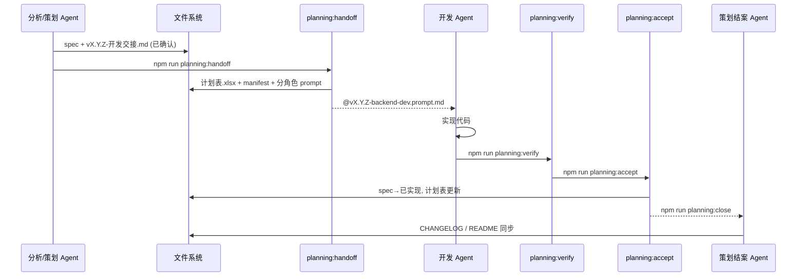

# 多 Agent 统一工作流

在 [策划到开发工作流.md](./策划到开发工作流.md) 基础上，将 **6 个专用 Agent** 接入同一套文件协议与 CLI 管道。

> 路由配置：`agent-routing.json`  
> 移交状态机：`handoffs/vX.Y.Z.json`

---

## 六个 Agent 与职责

| Workspace Agent | 角色 ID | 写什么 | 禁止写什么 | 产出后命令 |
|-----------------|---------|--------|------------|------------|
| **策划 Agent** | `planning` | `docs/planning/specs/*.md`、交接 md | `mobile/` `server/` `shared/` | `npm run planning:handoff -- vX.Y.Z` |
| **数据分析 Agent** | `data-analysis` | `docs/analytics/`、分析结论 spec | 业务源码 | `npm run planning:handoff -- vX.Y.Z --source data-analysis` |
| **后端维护分析 Agent** | `backend-ops-analysis` | 架构/运维 spec、`reports/` | `mobile/` | `npm run planning:handoff -- vX.Y.Z --source backend-ops-analysis` |
| **后端开发 Agent** | `backend-dev` | `server/` `shared/` `scripts/` | 改 spec 策划正文 | `npm run planning:verify` → `accept` |
| **前端开发 Agent** | `frontend-dev` | `mobile/` | 改 spec 策划正文 | `npm run planning:verify` → `accept` |
| **原画 Agent** | `art` | `mobile/assets/` `docs/art/` | 服务端逻辑 | `handoff`（目标多为 frontend-dev 接入资源） |

**策划 Agent（结案）**：验收 `accept` 之后执行 `npm run planning:close -- vX.Y.Z`，更新 CHANGELOG / README / 计划表。

每个 Agent 在 Cursor 中对应 **独立对话 + 独立 Rule**（见 `.cursor/rules/*-agent.mdc`）。对话标题建议带角色名，避免混用。

---

## 端到端管道



### pipeline_status（`handoffs/vX.Y.Z.json`）

| 状态 | 含义 |
|------|------|
| `handoff_ready` | 已登记计划表，已生成目标 Agent prompt |
| `verified` | 自动化验收脚本已通过 |
| `accepted` | 已标已实现，计划表已更新 |
| `closed` | 策划已完成文档收尾 |

---

## 阶段 0：需求元信息（所有分析/策划 Agent 必填）

在 spec 元信息表中增加（用于自动路由）：

| 字段 | 示例 | 说明 |
|------|------|------|
| 来源 Agent | 数据分析 | 对应 `agent-routing.json` |
| 目标开发 Agent | 后端开发 | 可留空，由路由规则推断 |
| 标签 | 数据分析, server, 模拟 | 逗号分隔，辅助路由 |

示例：

```markdown
| 来源 Agent | 数据分析 |
| 目标开发 Agent | 后端开发 |
| 标签 | analytics, server, 模拟 |
| 状态 | **已确认** |
```

---

## 阶段 1：分析/策划产出

### 数据分析 Agent

1. 运行模拟 / 导出报告到 `docs/analytics/`
2. 若需改代码：写 `specs/<主题>.md` + `vX.Y.Z-开发交接.md`（引用分析报告路径）
3. 你确认后状态 **已确认**
4. 运行：

```bash
npm run planning:handoff -- v0.5.2 --source data-analysis
```

默认路由 → **后端开发 Agent**（改 `scripts/` 模拟与管线）。

### 后端维护分析 Agent

1. 写架构/运维 spec（参考 v0.4.4 / v0.5 文档风格）
2. 交接 md 中写明 `verify:*` 建议
3. 运行：

```bash
npm run planning:handoff -- v0.5.2 --source backend-ops-analysis
```

### 策划 Agent

与 [策划到开发工作流.md](./策划到开发工作流.md) 相同，收尾用 `handoff` 而非仅 `confirm`。

### 原画 Agent

1. 产出资源到 `mobile/assets/` 或 `docs/art/<功能>/`
2. 写轻量 spec 说明尺寸、命名、挂载点
3. `handoff` 后由 **前端开发 Agent** 接入 UI

---

## 阶段 2：自动移交（`planning:handoff`）

一条命令完成：

1. spec / 交接 → **已确认**（可 `--force`）
2. 重建 **项目开发需求计划表.xlsx**
3. 生成基础 `prompts/vX.Y.Z-dev.prompt.md`
4. 按路由生成 **分角色 prompt**：
   - `prompts/vX.Y.Z-backend-dev.prompt.md`
   - `prompts/vX.Y.Z-frontend-dev.prompt.md`
5. 写入 `handoffs/vX.Y.Z.json`（含 `target_agents`、`verify_scripts`）

查看状态：

```bash
npm run planning:status -- v0.5.2
```

---

## 阶段 3：开发 Agent 执行

**必须为每个角色新开对话**，并启用对应 Rule：

| 开发 Agent | @ 文件 | Cursor Rule |
|------------|--------|-------------|
| 后端开发 | `prompts/vX.Y.Z-backend-dev.prompt.md` | `.cursor/rules/backend-dev-agent.mdc` |
| 前端开发 | `prompts/vX.Y.Z-frontend-dev.prompt.md` | `.cursor/rules/frontend-dev-agent.mdc` |

全栈需求会生成两个 prompt，**先后或并行**两个开发对话各做各的范围。

可选全自动（需 API Key）：

```bash
npm run planning:dispatch -- v0.5.2
```

---

## 阶段 4：自动验收

```bash
npm run planning:verify -- v0.5.2
```

按 manifest 中的 `verify_scripts` 依次执行 `npm run verify:*`。可在 handoff 时覆盖：

```bash
npm run planning:handoff -- v0.5.2 --verify verify:pond-navigation verify:session-timer-broadcast
```

---

## 阶段 5：结案与策划回写

```bash
# 开发侧：标已实现 + 更新计划表
npm run planning:accept -- v0.5.2

# 策划侧：文档收尾清单 + 再次确认计划表
npm run planning:close -- v0.5.2
```

**策划 Agent（结案对话）** 执行 `close` 后人工完成清单：

- `CHANGELOG.md` 实现节
- `specs/README.md` 索引
- spec §验收 `[x]`
- 全景文档（如有用户可见变更）

---

## 命令速查

| 命令 | 执行者 |
|------|--------|
| `npm run planning:handoff -- vX.Y.Z [--source …]` | 策划 / 分析 Agent |
| `npm run planning:status -- vX.Y.Z` | 任何人 |
| `npm run planning:verify -- vX.Y.Z` | 开发 Agent / 你 |
| `npm run planning:accept -- vX.Y.Z` | 开发 Agent / 你 |
| `npm run planning:close -- vX.Y.Z` | **策划 Agent** |

---

## 如何实现「尽量自动」

| 自动化程度 | 做法 |
|------------|------|
| **半自动（当前推荐）** | 各 Agent 收尾跑对应 npm 命令；你按 manifest 提示开新对话 @ prompt |
| **同会话子代理** | 分析 Agent 说：「用 Task 读 `handoffs/vX.Y.Z.json` 并派给 backend-dev prompt」 |
| **SDK 派发** | `planning:dispatch` + `CURSOR_API_KEY` |
| **全自动（可选）** | Cursor Automation：监听 `handoffs/*.json` 新建 → 触发 Cloud Agent 读对应 prompt（需自行在 Automations UI 配置） |

Cursor 目前**不能**在无人工确认下跨 6 个独立 Agent 对话全自动串联；用 **manifest + 分角色 prompt + 固定 npm 管道** 把人工步骤压到 2 次：① handoff 后开开发对话 ② accept 后开策划结案对话。

---

## 变更记录

| 日期 | 变更 |
|------|------|
| 2026-07-09 | 初稿：6 Agent 路由、handoff manifest、verify/accept/close 管道 |
