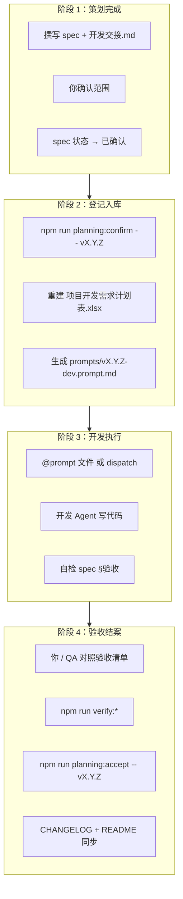

# 策划 → 开发 → 验收 工作流

本文是 **策划案落地到代码** 的标准流程：从本地 spec 写入，到 `项目开发需求计划表.xlsx` 登记、开发提示词派发、验收结案与状态回写。

> 角色分工见 [HANDOFF.md](./HANDOFF.md)。  
> 策划文档规范见 [WORKFLOW.md](./WORKFLOW.md)。

---

## 总览



---

## 阶段 1：策划完成（策划 Agent）

### 产出物（全部落在 `docs/planning/`）

| 文件 | 必填 | 说明 |
|------|------|------|
| `specs/<功能名>.md` | ✅ | PRD：背景、范围、验收标准、非目标 |
| `specs/vX.Y.Z-开发交接.md` | ✅ | 产品决策 + **交接提示词** 代码块 |
| `CHANGELOG.md` | 策划节 | 新增策划条目（→ **已确认**） |
| `specs/README.md` | 建议 | 索引表增加一行 |

### 策划 Agent 自检

- [ ] spec 元信息 `状态` = **已确认**
- [ ] 验收标准为可勾选条目（§5 或同等章节）
- [ ] 交接文档含 `## 交接提示词` + fenced 代码块
- [ ] **未** 修改 `mobile/`、`server/`、`shared/`
- [ ] 你已对范围签字（口头/对话确认即可）

### 策划结束语（复制给用户）

> 策划已完成：`specs/<功能>.md`（已确认）  
> 请运行：`npm run planning:confirm -- vX.Y.Z`  
> 然后将生成的 `prompts/vX.Y.Z-dev.prompt.md` 交给开发 Agent。

---

## 阶段 2：登记入库（你或策划 Agent）

一条命令完成 **计划表更新 + 提示词生成**：

```bash
npm run planning:confirm -- v0.5.2
```

等价于：

```bash
python scripts/planning/planning_workflow.py confirm v0.5.2
```

### 命令做了什么

1. 检查 `specs/v0.5.2-开发交接.md` 存在
2. 从交接文档解析 **策划文档** 路径，确认主 spec 为 **已确认**（可用 `--force` 自动改写）
3. 重建 [`项目开发需求计划表.xlsx`](./项目开发需求计划表.xlsx)（sheet：开发计划 / 数据平台-Phase 0/1 / 架构修复 / Bug修复 / 统计摘要）
4. 生成 [`prompts/v0.5.2-dev.prompt.md`](./prompts/v0.5.2-dev.prompt.md)

### 计划表字段说明

| 列 | 含义 |
|----|------|
| 文档状态 | spec 文件内原始状态 |
| 有效状态 | 以 CHANGELOG + 覆盖表校正后的开发状态 |
| 开发顺序 | 按 Git 首次提交时间排序 |

仅重建 xlsx、不生成 prompt：

```bash
npm run planning:export
```

---

## 阶段 3：开发执行（开发 Agent）

### 派发方式（三选一）

| 方式 | 操作 |
|------|------|
| **A. @ 文件（推荐）** | 新开发对话 → `@docs/planning/prompts/vX.Y.Z-dev.prompt.md` →「按此实现」 |
| **B. Task 子代理** | 同会话：「用 Task 读 prompt 并实现」 |
| **C. SDK** | `npm run planning:dispatch -- vX.Y.Z`（需 `CURSOR_API_KEY`） |

详见 [prompts/README.md](./prompts/README.md)。

### 开发 Agent 约束

- 只读 **已确认** 的 spec，严格 P0 范围
- 完成后自检 spec §验收标准
- **不要** 自行改 spec 为「已实现」——留到验收结案命令统一处理（或你明确要求时手动改）

### 开发中查看状态

```bash
npm run planning:status -- v0.5.2
```

---

## 阶段 4：验收结案

### 4.1 验收清单

复制 [templates/验收清单模板.md](./templates/验收清单模板.md)，对照 spec §验收 与 `verify:*` 脚本逐项勾选。

常见验收命令（按 spec 选用）：

```bash
npm run verify:a0
npm run verify:auth
npm run verify:session-checkpoint
npm run verify:server-observability
npm run verify:pond-navigation
npm run verify:session-timer-broadcast
```

### 4.2 验收通过后结案

```bash
# 先跑验收脚本（可选但推荐）
npm run verify:pond-navigation

# 更新 spec/交接状态 + 重建计划表 + 输出 CHANGELOG 草稿
npm run planning:accept -- v0.5.2 --verify verify:pond-navigation
```

`accept` 会：

1. （可选）执行 `--verify` 指定的 npm script
2. 主 spec + 交接文档 `状态` → **已实现**
3. 重建 `项目开发需求计划表.xlsx`
4. 在终端打印 **CHANGELOG 草稿**（粘贴到 `CHANGELOG.md` 顶部）

### 4.3 验收后人工收尾

- [ ] 将 CHANGELOG 草稿写入 `docs/planning/CHANGELOG.md`
- [ ] 更新 `specs/README.md` 对应行状态
- [ ] 开发 Agent 回写 `product/vX.Y.Z-功能全景.md`（若涉及用户可见行为）
- [ ] 勾选 spec 内 §验收 全部 `[x]`

批量同步历史 spec 状态（仅维护用）：

```bash
npm run planning:sync-status
```

---

## 状态流转

| 状态 | 含义 | 触发 |
|------|------|------|
| 草案 / 评审中 | 策划撰写 | 策划 Agent |
| **已确认** | 可开发 | 你确认 + `planning:confirm` |
| **已实现** | 验收通过 | `planning:accept` |
| 已废弃 | 被新 spec 替代 | 策划标注 |

**计划表 xlsx** 的「有效状态」列与 spec 文件保持一致；`confirm` / `accept` 后自动重建。  
**Agent 结案 checklist（Skill）**：项目内 [`.cursor/skills/planning-progress-sync/SKILL.md`](../../.cursor/skills/planning-progress-sync/SKILL.md) — 验收后必须改 `build-master-plan-xlsx.py` 并 `npm run planning:master-xlsx`（**同时刷新** [`策划进度看板.html`](./策划进度看板.html)）。

---

## 命令速查

| 命令 | 阶段 | 作用 |
|------|------|------|
| `npm run planning:confirm -- vX.Y.Z` | 策划完成 | 登记计划表 + 生成开发 prompt |
| `npm run planning:prompt -- vX.Y.Z` | 仅生成 prompt | 从交接 md 提取提示词 |
| `npm run planning:export` | 任意 | 仅从 specs 重建 xlsx |
| `npm run planning:status -- vX.Y.Z` | 开发中 | 查看文档与 prompt 状态 |
| `npm run planning:accept -- vX.Y.Z [--verify xxx]` | 验收后 | 标已实现 + 重建 xlsx + CHANGELOG 草稿 |
| `npm run planning:dispatch -- vX.Y.Z` | 开发派发 | SDK 自动启动 Cloud Agent |
| `npm run planning:sync-status` | 维护 | 批量校正 spec 状态字段 |

---

## 新需求文件清单（策划 Agent 复制用）

以 `v0.5.2` 为例：

```
docs/planning/specs/<功能名>.md              # 主 spec，状态=已确认
docs/planning/specs/v0.5.2-开发交接.md        # 含交接提示词代码块
docs/planning/prompts/v0.5.2-dev.prompt.md    # confirm 后自动生成
项目开发需求计划表.xlsx（仓库根目录）      # confirm/accept 后自动更新；docs/planning/ 同步副本
```

---

## 变更记录

| 日期 | 变更 |
|------|------|
| 2026-07-09 | 初稿：串联计划表、prompt、验收结案 CLI |
